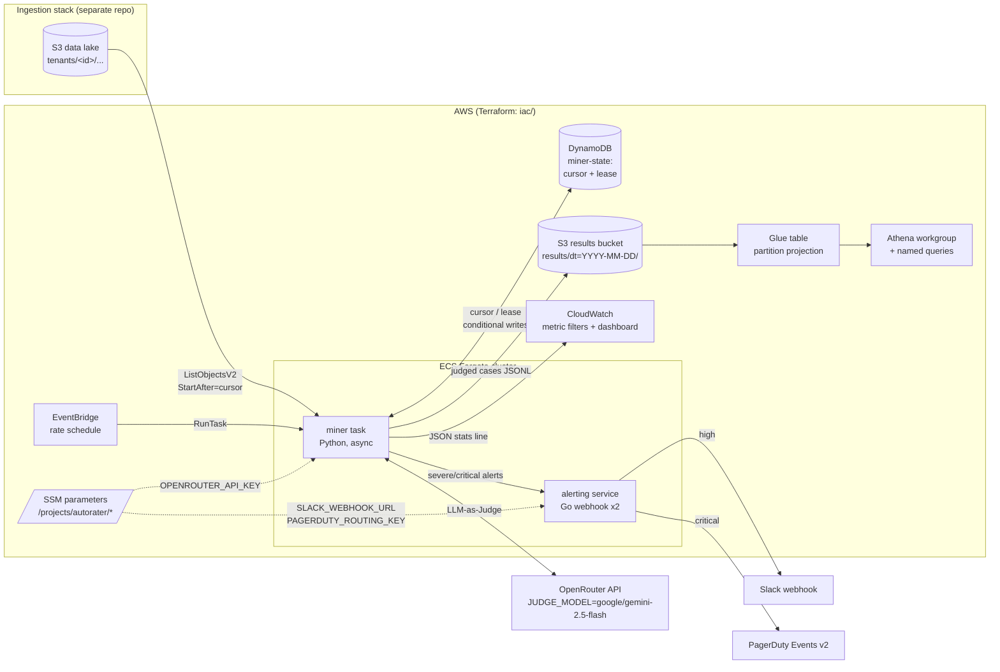
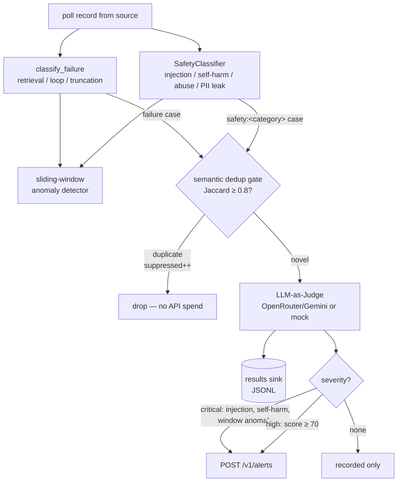
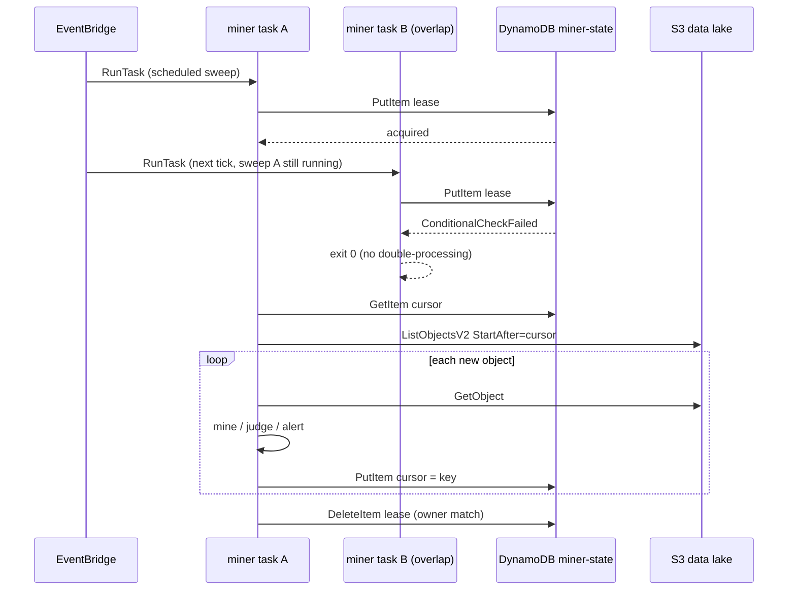
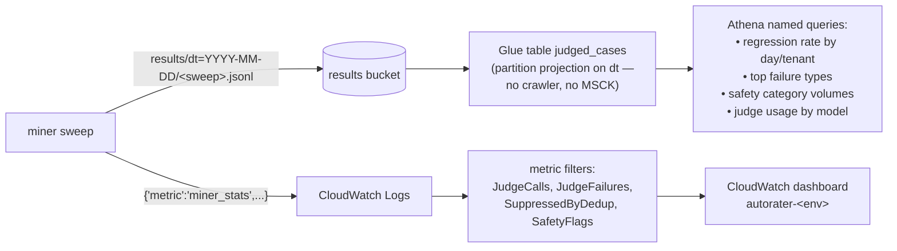
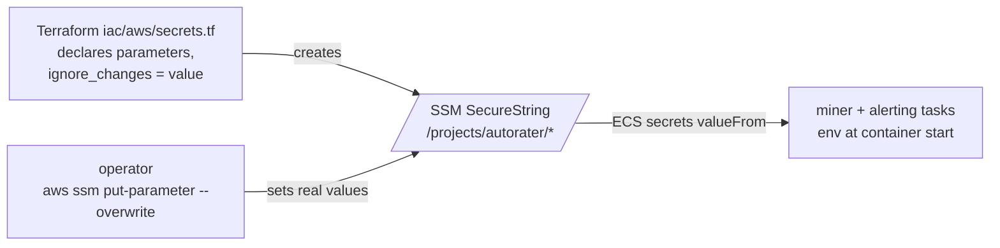

# Architecture — Autorater

## High-level component & data flow

## Miner pipeline (per record)

## Durable cursor & single-runner lease

A crash between processing and the cursor write re-delivers exactly the
in-flight record on the next sweep (at-least-once). Keys are date-ordered, so
`StartAfter` resume is chronological; lexically-earlier backfills are skipped
by design.

## Analytics path

## Secrets flow

